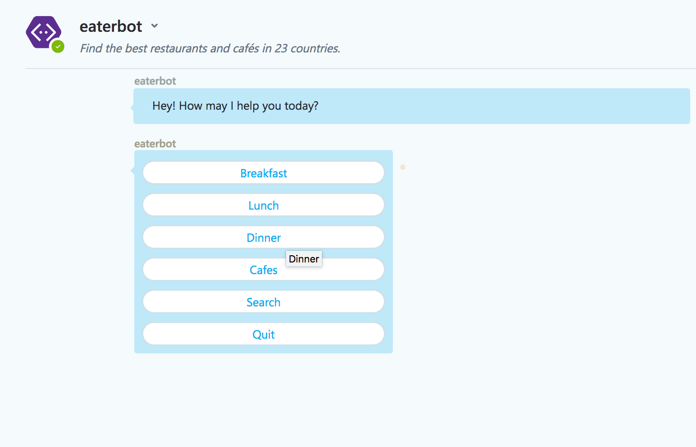
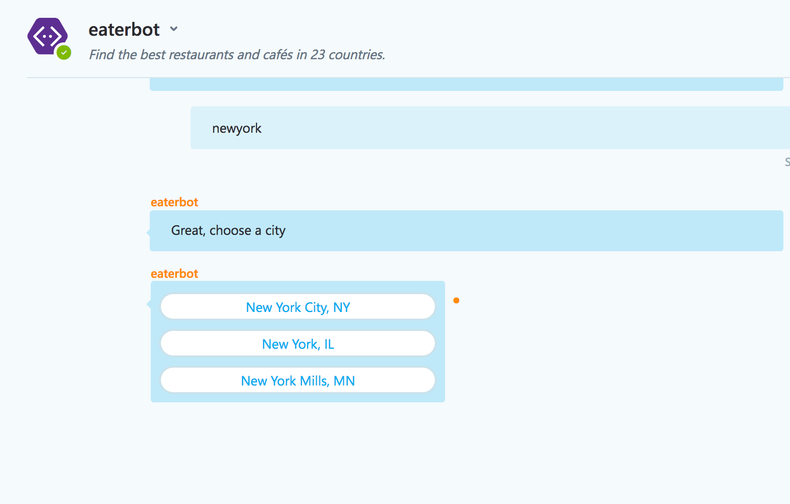
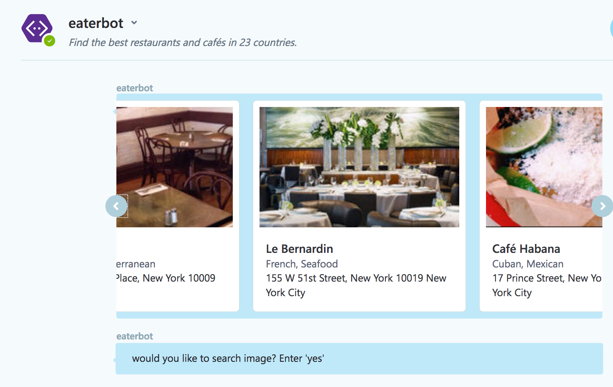
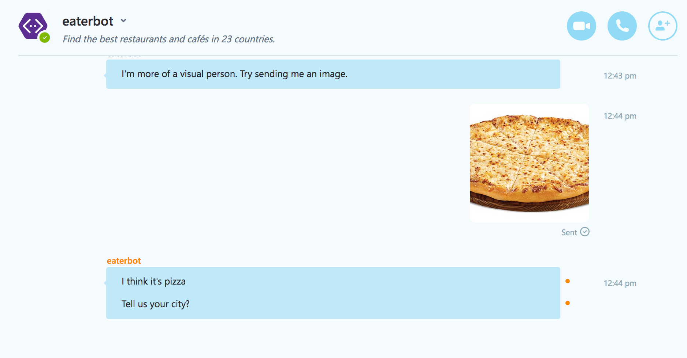
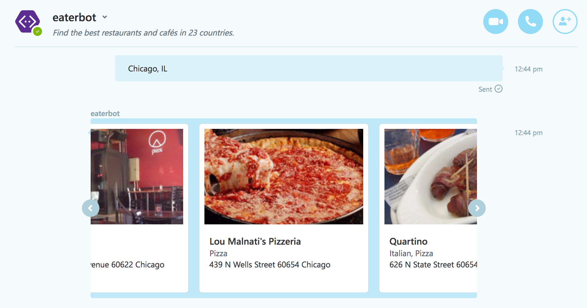

# Eater-bot

Find the best restaurants, and cafés, search by city and image.

Demo: https://webchat.botframework.com/embed/Eater-Bot?s=beR_2hbk35E.cwA.9tE.3BUQRfDU3AKS88t8DsJcv5QVO1odP-Axi3SD7_MGM1w

### What it does

Eater bot finds the restaurants by image and category.

Step 1:Different categories like breakfast, lunch dinner, and cafes or uploading food image is used to search restaurants.

Step 2: List of cities are listed based on user input.

Step 3: Display 10 restaurants based on category/image and city.

### Technologies and API

Eater bot is build using node JS and Microsoft Bot Framework.
We used 3 API’s LUIS API, Microsoft Computer Vision API and Zomato API.
Trained LUIS to detect the dialog based on natural language.

### Images

